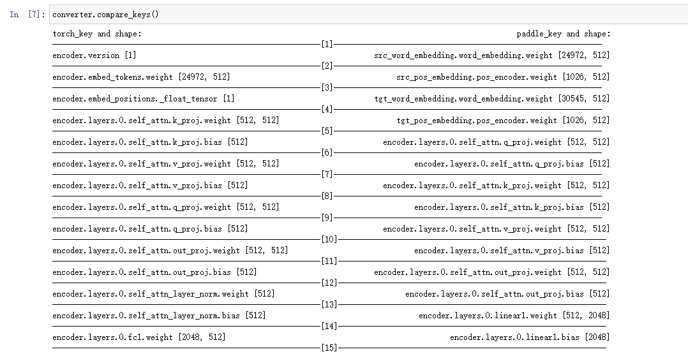

# easy_align
make align torch weights to paddle easy.

## 1.安装和卸载

```shell
git clone https://github.com/MiuGod0126/easy_align
cd easy_align
# 安装 
python setup.py install
# 卸载
pip uninstall easyAlign
```

## 2.创建转换器

```python
import torch
import paddle
from easyAlign import Torch2PaddleConverter
# 加载权重
torch_weights=torch.load('checkpoint_best.pt')['model']
paddle_weights=paddle.load('transformer.pdparams')

# 创建转换器
converter=Torch2PaddleConverter(torch_weights,paddle_weights)
```

## 3.写转换规则（建议在notebook下完成）

使用compare_keys可以规整的打印torch和paddle的参数，便于写转换规则。

```python
# 打印参数
converter.compare_keys()
```



需要有skip_weights，donot_transpose，torch_to_paddle_keys，special_case_fn（可以没有）,下面是一个fairseq和paddle转换transformer权重的例子：

```python
## 1、需要跳过的torch权重
skip_weights=["encoder.version","decoder.version","encoder.embed_positions._float_tensor","decoder.embed_positions._float_tensor"] 
## 2、不需要转置的weight，如embed
donot_transpose=['encoder.embed_tokens.weight','decoder.embed_tokens.weight'] 
## 3、参数名名映射 
torch_to_paddle_keys={"encoder.embed_tokens.weight":"src_word_embedding.word_embedding.weight",
                     "decoder.embed_tokens.weight":"trg_word_embedding.word_embedding.weight",
                     "fc1":"linear1",
                     "fc2":"linear2",
                      "self_attn_layer_norm":"norm1",
                      "encoder_attn_layer_norm":"norm2",
                      "encoder_attn.":"cross_attn.", # 注意别把norm的替换掉了
                       "decoder.output_projection.weight":"linear.weight"
                     }
## 3、特殊参数名处理（当3参数名映射处理不了时设置）
def special_case_fn(key):
    special_key="final_layer_norm" # 在encoder是norm2 在decoder是norm3
    special_val="norm2" if paddle_k.find("encoder")!=-1 else "norm3"
    key=key.replace(special_key,special_val)
    return key
```

## 4.转换权重

```python
# 转换权重
paddle_weights=converter.align_weights(skip_weights=skip_weights,
                        donot_transpose=donot_transpose,
                        torch_to_paddle_keys=torch_to_paddle_keys,
                        special_case_fn=special_case_fn)
# 保存权重
paddle.save(paddle_weights,'model.pdparams')
```


至此，torch权重就能愉快的转为paddle了，第3步较为繁琐，不过一般只要弄清楚 嵌入、输出和模型第一层就行了、希望能帮助大家简化转换的流程。
